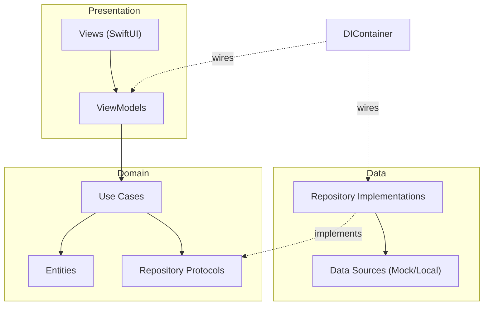

# iOS Restaurant App

A modern iOS restaurant ordering application built with Swift and SwiftUI following Clean Architecture principles.

## Features

- Restaurant browsing and discovery
- Menu viewing with item details
- Shopping cart management
- Order placement and tracking
- User authentication

## Architecture

The app follows **Clean Architecture** with clear separation of concerns and a one-way dependency rule: Presentation depends on Domain, Data depends on Domain, and Domain depends on nothing but Foundation.



```
restaurant/
├── App/              # App entry point and configuration
├── Core/             # Core utilities, extensions, DI container
├── Data/             # Data layer (repositories, data sources, DTOs)
├── Domain/           # Business logic (entities, use cases, repository protocols)
├── Presentation/     # UI layer (views, view models)
└── Resources/        # Assets, localization, etc.
```

### Layer Responsibilities

| Layer | Responsibility |
|-------|----------------|
| **Domain** | Business entities, use cases, repository interfaces |
| **Data** | Repository implementations, API clients, local storage |
| **Presentation** | SwiftUI views, view models, UI state management |

## Decisions & trade-offs

- **Manual, protocol-based DI over a framework (e.g. Swinject)** — a lightweight `DIContainer` with lazy properties keeps build times fast and avoids a third-party dependency for an app this size. At scale (multiple feature teams, 50+ screens), I'd move to a code-generated or macro-based DI approach to cut the container's boilerplate.
- **Domain depends only on Foundation**, never on SwiftUI/Combine — `Cart`, `Order`, and `Reservation` business logic stay platform-agnostic and unit-testable without spinning up UI.
- **Repository protocols live in Domain, implementations in Data** — inverts the dependency so Domain never imports Data. The trade-off: swapping `MockDataSource` for a real network/persistence layer is a Data-only change, but every new repository needs a protocol added in two places.
- **Deliberately out of scope**: real networking, auth, and persistence (Core Data/SwiftData) — the sample uses `MockDataSource` to keep the focus on architecture, not infrastructure.

## Tech Stack

- **Language**: Swift
- **UI Framework**: SwiftUI
- **Architecture**: Clean Architecture + MVVM
- **Dependency Injection**: Manual DI
- **Networking**: URLSession / Async-Await

## Requirements

- iOS 15.0+
- Xcode 14.0+
- Swift 5.7+

## Getting Started

1. Clone the repository
2. Open `restaurant/restaurant.xcodeproj` in Xcode
3. Select a simulator or device
4. Build and run (⌘R)

## Project Structure

```
ios_restaurant/
├── restaurant/
│   ├── restaurant/           # Main app source
│   ├── restaurant.xcodeproj  # Xcode project
│   ├── restaurantTests/      # Unit tests
│   └── restaurantUITests/    # UI tests
└── docs/                     # Documentation
```

## Testing

- **Unit Tests**: Located in `restaurantTests/`, covering `Cart` domain logic and cart use cases.
- **UI Tests**: Located in `restaurantUITests/`.

Run tests with ⌘U in Xcode.

## License

MIT License
